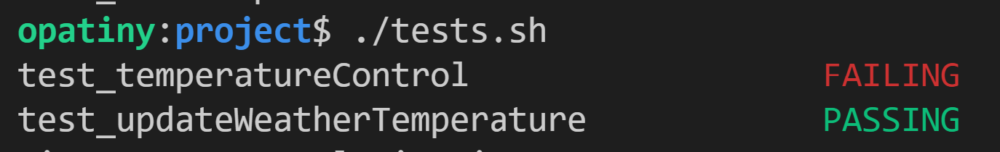

# Easy C test environment

## Concept
We created a very easy environment to test C code. Basically, a bash script, `tests.sh` has to be run every time the code has to be tested. The script does a bunch of stuff, and in the end, it shows an ouput that looks like this:


## `tests.sh` actions
This script:
-  automatically generates the `tests.c` file, based on all the files in subfolders which have the extension `.test.c`
- compiles `tests.c` and all the other C files that are in subfolders
- outputs `tests.out`
- runs `tests.out`

## The test files
The test files are placed in a folder called `__tests__` at the level of the files to test. The test for an individual script consists of two files: a `.test.c`and `.test.h`. By convention, we name the files the same way as the script that is tested.

### The `.test.c` file

The `.test.c` file can contain many functions, which name will start with `test_`, followed by the name of the funciton tested. The only parameter these functions must have is `void`. Each of these function returns 1 (`TEST_FAILING`) if the test fails, or 0 (`TEST_PASSING`) if the test passes. A basic library called `testcases` was implemented in order to provide useful test functions.

__Example__

The underneath file if called `controllers.test.c`. It is the test file of a script called `controllers.c`.

```cpp
#include "../../lib/testcases.h"
#include "../controllers.h"

int test_phControlModel(void) {
  int NB_CASES_FAILING = 0;

  PUMP pump1 = {.currentValue = 0, .phThreshold = 5, .factor = 10};

  phControlModel(3, &pump1);
  shouldBeGreaterThan_d(&NB_CASES_FAILING, pump1.currentValue, 0.0);

  phControlModel(8, &pump1);
  shouldBeEqual_lf(&NB_CASES_FAILING, pump1.currentValue, 0.0, 0.0);

  if (NB_CASES_FAILING) {
    return TEST_FAILING;
  }
  return TEST_PASSING;
}
```

In this example, `shouldBeGreaterThan_d()`, `shouldBeEqual_lf()`, `TEST_FAILING` and `TEST_PASSING` come from the `testcases` library.

### The `.test.h` file

The `.test.h` file must contain the prototypes of all the test functions defined in the corresponding `.test.c` file.

__Example__
This would the the `.test.h` file of the previous example. It would be called `controllers.test.h`.
```cpp
int test_phControlModel(void);
```

## Important conventions to follow

A few conventions have to be respected for the tests to work:
- there must not be any file containing a `main()` function in any of the subfolders of the project
- the test functions prototypes put in the `.test.h` files have to contain `void` as a parameter (we do a regular expression based on this pattern to generate `tests.c`)

Additionnally these conventions are used, but are not mandatory:
- all test files are placed in subfolders that are called `__tests__`
- the test files have to be named the same way as the files tested, with the extensions `.test.c`and `.test.h`
